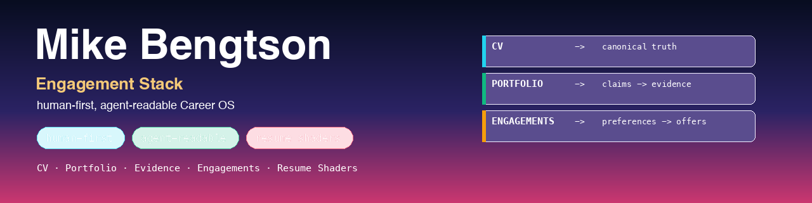

<a name="top"></a>

[](https://mikebengtson.github.io/)

# Mike Bengtson — Engagement Stack

> **Have your agent call mine.**

<p>
  <a href="https://mikebengtson.github.io/"></a>&nbsp;
  <a href="AGENTS.md"></a>&nbsp;
  <a href="https://github.com/MikeBengtson/engagement-stack"></a>&nbsp;
  <a href="LICENSE"></a>&nbsp;
  <a href="resume-shaders/README.md"></a>
</p>

I'm an **AI engineering leader (VP / Director)**. This repository is my personal **Engagement Stack** — a human-first, agent-readable Career OS. It's a source-controlled professional dossier: CV and work history, portfolio evidence, engagement preferences, structured offer requests, an evaluation rubric, resume shaders, and job-search submission materials — all in one place that humans can browse and agents can read, cite, and tailor without inventing facts.

It is a real, populated instance of the open-source **[Engagement Stack framework](https://github.com/MikeBengtson/engagement-stack)** — same structure, my actual data.

## Three ways in

| If you're… | Start here |
|---|---|
| 🧑 **A human** — recruiter, hiring leader, or peer | **[mikebengtson.github.io](https://mikebengtson.github.io/)** — the polished human-readable surface: positioning, experience, proof, and a 3-page résumé PDF. |
| 🤖 **An agent** | **[AGENTS.md](AGENTS.md)** — how to read, cite, score, and tailor this stack, and where the public/private boundaries are. |
| 🧩 **Curious about the framework** | **[github.com/MikeBengtson/engagement-stack](https://github.com/MikeBengtson/engagement-stack)** — the open-source template this is built on. |

## Core rule

**Markdown is the human source of truth. YAML is the agent surface.** Most human documents have a YAML sidecar: the Markdown explains the work; the YAML gives agents structured fields for routing, matching, scoring, validation, and export.

## Public repo, private overlay

This repository is public-safe by design. Compensation floors and targets, hourly / retainer / fixed-bid rates, negotiation strategy, and sensitive constraints live **only in a local, gitignored `private/` overlay that is never committed**. Public files state that those thresholds *exist* — they never reveal the numbers. (`.gitignore` keeps `private/` and `*.private.*` out of version control.)

Agents: read public files first, then a local `private/` overlay **only if present**. If it's absent, do not infer hidden floors or constraints — ask.

## What's here

```text
.
├── AGENTS.md            # ← agent instructions (start here if you're an agent)
├── profile/             # identity, positioning, operating style
├── cv/                  # canonical CV, work history, skills, resume source
├── portfolio/           # projects → claims → evidence → case studies
├── evidence/            # proof index: repos, live products, artifacts, references
├── career-strategy/     # target roles, markets, positioning, search strategy
├── engagements/         # engagement models, preferences, evaluation rubric (public-safe)
├── resumes/             # short (~2pg) + long (~3pg) variants; originals preserved verbatim
├── resume-shaders/      # role/industry-specific resume shaping
├── styles/              # navy presentation theme
├── submissions/         # LinkedIn kit, ATS, Indeed, USAJOBS, cover letter, email
├── docs/                # the published human-readable site → mikebengtson.github.io
├── integrations/        # optional upstream/downstream contracts (e.g., Job Search Superpower)
├── resources/branding/  # this README's banner + social assets
├── private/             # LOCAL ONLY, gitignored — compensation, constraints, negotiation
└── generated/           # rebuildable render artifacts (gitignored)
```

## Résumé & submission outputs

Two résumé **lengths**, both navy-themed, plus a matching cover letter and ATS-plain exports. `scripts/render-resumes.sh [short|long|cover-letter|ats|all]` renders the designed PDFs (Pandoc → [`styles/navy.css`](styles/navy.css) → headless Chrome); the ATS DOCX/TXT come straight from Pandoc. The polished 3-page PDF is published on the [human surface](https://mikebengtson.github.io/).

Ground-truth résumés are used as-is — originals are preserved verbatim in [`resumes/originals/`](resumes/originals/); shaders in [`resume-shaders/`](resume-shaders/) layer role/industry emphasis on top.

## Built on Engagement Stack

This is a personal instance of the **[Engagement Stack](https://github.com/MikeBengtson/engagement-stack)** framework — a human-first, agent-readable Career OS. See the framework repository for the template, setup guide, and full documentation.

[⬆ back to top](#top)
